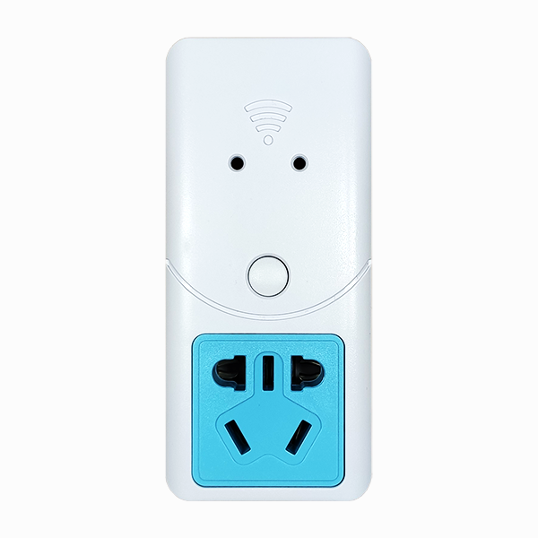
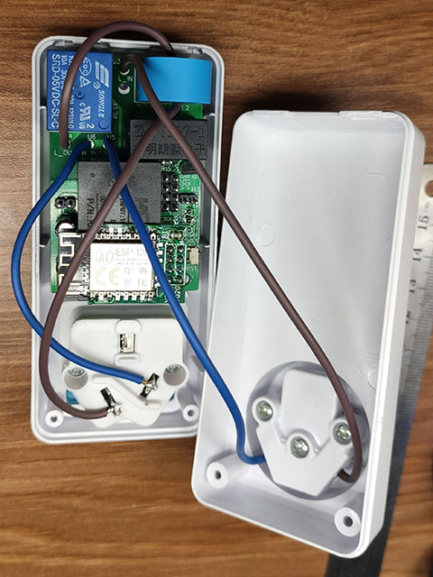

# 简介
腾讯云物联网智能插座，支持微信小程序远程控制，可查看电压、电流、功率、累计用电量等信息。


# 警告
本项目包含强电电路，开发过程中请注意安全！


# 开源资料
视频演示  
https://www.bilibili.com/video/BV1qK4y1d7XK/  

电路图与PCB  
https://oshwhub.com/Code504/tencent-iot-smart-socket  

工程代码  
https://gitee.com/dma/tencent-cloud-iot-smart-socket  


# 使用说明
## 图片展示
插座正面  
  

焊接完成后PCB正面  
  

焊接完成后PCB背面  
  

接线参考  
  


## 参数说明
* 最高输入电压：250V
* 最大负载电流：5A
* 最大负载功率：1100w
* 待机功率：小于2w

## 功能特性
* 微信小程序远程控制
* 支持定时开关
* 可查看电压、电流、功率、累计用电量等信息
* 累计用电量超过10000度以后自动清零并重新开始计数
* 过载保护，负载电流超过5A强制断电并发送告警信息
* 呼吸灯直观指示负载功率
* 测量小功率用电器时（如待机的电视、小夜灯、没有连接手机的充电器等）误差较大，测量结果仅供参考

## 使用说明
1. 智能插座接通电源，等待绿色指示灯亮起
2. 打开微信，在主页面下拉，搜索“腾讯连连小程序”
3. 点击加号添加设备，在电工照明中选择“插座”（或扫描二维码），按提示进行操作
4. 长按智能插座的按键5秒后松开，蓝色指示灯闪烁，开始配网
5. 配网完成后设备自动重启，小程序主页面可看到刚刚添加的设备
6. 配网失败请重复第2、3、4步
7. 进入设备主页面可控制开关、设置倒计时、查看电压、电流、功率、累计用电量等信息
8. 设置倒计时，当倒计时减为0时开关的状态会翻转
9. 负载电流超过5A智能插座会强制断电并推送告警信息，重新开关一次即可恢复正常

## 按键说明
* 单击控制开关
* 长按5秒配网
* 长按10秒恢复出厂设置，清空累计用电量等所有数据

## 指示灯说明
|   颜色   | 状态                           |
| :------: | :----------------------------- |
| 绿色长亮 | 设备工作正常，待机中，负载断电 |
| 七彩呼吸 | 设备工作正常，负载电源已接通   |
| 蓝色闪烁 | 网络连接中，配网中             |
| 白色闪烁 | 恢复出厂设置                   |
| 红色闪烁 | 负载电流过大，强制断电         |

负载电源接通后指示灯变为七彩呼吸状态，指示灯颜色与负载功率相关，功率由小到大依次为蓝青绿黄红。
颜色与功率参考
|   功率   | 颜色  |
| :------: | :---: |
|  0-100w  | 蓝色  |
| 100-300w | 青色  |
| 300-500w | 绿色  |
| 500-800w | 黄色  |
| 800w以上 | 红色  |


# 硬件开发
原理图及PCB参见上方开源链接及doc目录内相关资料

## 元件选型：
1. 我采用的是 STM32G070KBT6，不改动PCB的情况下可替换其他STM32G0系列的LQFP32封装的芯片，例如 STM32G030K8T6、STM32G071KBT6、STM32G081KBT6、STM32G431KBT6等，当然软件上需要有一些改动，在软件开发章节中会有详细说明。
2. wifi芯片采用的是ESP-12F模组，由于空间有限，这里不得不采用转接板配合20mm长排针焊接在电源模块的上方。ESP的模组需要刷腾讯云固件，该固件要求Flash必须大于等于2MB，你可以选购其他Flash满足要求的ESP8266模组配合转接板使用。转接板的排针引脚与ESP-01模组完全兼容，如果打算使用ESP-01模组除了要更换长排针，还要确认Flash是否满足要求，据我所知ESP-01模组都是1MB的Flash，你需要自行更换2MB的Flash或购买加大Flash的型号。
4. 继电器型号为 SRD-05VDC-SL-C，额定负载电流为5A，如需更大负载电流可更换其他型号，并同时更换电流互感器、修改PCB加粗相关线路。
5. 电流互感器型号为 ZMCT103C，额定电流为5A，如需更大负载电流可更换其他型号，并同时更换继电器。
6. 电量计芯片型号为 HLW8032，可更换 HLW8012、BL0937 等兼容芯片，另外的这几款芯片为PWM输出，PCB预留兼容设计，可以修改 SJ3 跳线并焊接 R14 电阻使用单片机的输入捕获引脚来接收信号。注意：其他几款芯片的程序没有开发，请自行适配！

## 排针说明：
1. 如图所示，H4为5V供电，H1为STLINK接口，H2为单片机调试串口，H3为ESP8266模组串口
   
2. 板上预留3个 ESP8266 模组的烧写跳线。在“run”和“flash”丝印的上方，短接所有跳线的左、中两个焊盘两个为运行模式，短接所有跳线的中、右两个焊盘两个为烧写模式。烧写模式下请将串口连接在`ESP TR`丝印标记的两个排针上
3. SJ1 为单片机 BOOT 跳线；SJ3 为电量计芯片兼容跳线，短接左、中两个焊盘电量计的输出信号连接至单片机输入捕获引脚，短接中、右两个焊盘电量计的输出信号连接至单片机串口输入引脚。
   

## 其他说明：
1. 火线、零线连接方式请参考前面的图片，输出火线一定要穿过电流互感器，如果将输入火线穿过电流互感器则智能插座自身的待机电流也会被同时测量。
2. 复位键及其相关电阻、电容主要是为方便调试，可以省略。
3. 为了使用方便指示灯采用的是WS2812，和外壳上预留的指示灯孔不匹配，这里最好用热熔胶、环氧胶之类的透光性比较好的胶封起来，就怕有人手贱拿东西乱捅，毕竟旁边就是高压电路，很危险！

# 成本估算
以下为我采购时的价格，仅供参考
|    名称    |                型号                 |  单价 |
| :--------: | :---------------------------------: | ----: |
| 外壳与五金 |                 无                  |  5.50 |
|  电源模块  |              HLK-PM01               | 11.00 |
|    主控    |            STM32G070KBT6            | 12.50 |
| 电流互感器 |              ZMCT103C               |  2.72 |
| 电压互感器 |              ZMPT107-1              |  4.11 |
| 电量计芯片 |               HLW8032               |   3.6 |
|   继电器   |           SRD-05VDC-SL-C            |  2.36 |
|  WIFI模块  |               ESP-12F               |  8.83 |
|    PCB     |                 无                  |  3.00 |
|  其他元件  | 电线、电容、电阻、排针、按键、LED等 | 10.00 |
共计63.62元

## 降本方案
以下降本方案仅提供思路，所有软硬件需自行开发。
* STM32G070KBT6 可以替换为 STM32G030K8T6，或者其他价格更便宜的单片机，但是代码上需要对内存大幅度优化
* 去掉单片机，直接在ESP8266上进行二次开发，这种方式的开发工作量最大，但降本幅度也是最大的
* 电源模块可以在某网站上找一找，最便宜的5V 3W电源模块甚至只要6元
* 采用单电源非隔离方案可以节省下电流互感器、电压互感器的成本，代价就是整个电路板带强电
* 采用双电源非隔离方案也可以节省下电流互感器、电压互感器的成本，但是节省下来的成本可能和添加一个非隔离电源差不多


# 后台开发
## 新建项目与产品
1. 在 [腾讯云](https://cloud.tencent.com/) 官网注册开发者账号（已注册请略过）
2. 登录 [物联网开发平台](https://console.cloud.tencent.com/iotexplorer)，参考 [项目管理](https://cloud.tencent.com/document/product/1081/40290) 新建项目
3. 参考 [产品定义](https://cloud.tencent.com/document/product/1081/34739) 新建产品并填写产品信息，其中【产品品类】选择【智慧生活】->【电工照明】->【插座】，【设备类型】选择【设备】，【认证方式】选择【密钥认证】，【通信方式】选择【Wi-Fi】，【数据协议】选择【数据模板】，创建完成后点击保存

## 数据模板
1. 点击刚刚创建的产品，点击【数据模板】
2. 点击【导入JSON】，你也可以在下方定义自己的数据模板
   
3. 在这里将 `project\智能插座.json` 的内容粘贴进去，完成后点击【保存】
   
4. 更多内容请参考官网文档 [数据模板](https://cloud.tencent.com/document/product/1081/44921)

## 设备开发
1. 在【设备开发】标签页下可以选择【基于OS开发】或跳过，不影响本项目后续开发流程
2. 在【Topic列表】标签页下可以查看已有的Topic或添加自定义Topic，本项目不需要，可跳过
3. 更多内容请参考官网文档 [设备开发](https://cloud.tencent.com/document/product/1081/34740)

## 交互开发
1. 依次点击【交互开发】、【配置小程序】、【面板配置】
   
2. 如图所示，这里可以配置小程序的页面，你可参考我的布局，或按自己喜欢的方式配置
   
3. 依次点击【交互开发】、【配置小程序】、【配网引导】，在【选择配网方式】标签页下参照图片进行设置，【芯片方案选择	】设置为【乐鑫】，【首选配网方式】设置为【Smart Config】，【次选配网方式】设置为【Soft Ap】或【无】
   
4. 更多内容请参考官网文档 [交互开发](https://cloud.tencent.com/document/product/1081/40457)

## 设备调试
1. 设备端代码编译并下载后你可以在这里进行在线调试，
2. 点击【设备信息】可以看到【设备名称】、【设备密钥】、【产品ID】，后续开发过程会用到这些信息
   
3. 更多内容请参考官网文档 [设备调试](https://cloud.tencent.com/document/product/1081/34741)

## 批量投产
个人DIY玩家可以忽略，正式量产请参考官网文档 [批量投产](https://cloud.tencent.com/document/product/1081/54534)

## 数据开发
当智能插座检检测到负载电流过大时会强制断电并上报告警消息，下面进行相关功能设置
1. 在左侧选择【数据开发】点击【新建数据流】，在弹出的串口内填入必要信息
   
2. 拖入所需的功能模块并进行配置、连接
3. 如图所示，在设备事件中选择你的智能插座产品，在【选择事件】中选择【DeviceStatus】，在【选择事件属性】中选择【Message】
   
4. 如图所示。在【数据过滤】的【条件组合方式】选择【全部或】，过滤条件设置为【Message】、【等于】、【overcurrent】
   
5. 如图所示。在【APP推送】或【公众号推送】中填入推送标题及推送内容
   
6. 设置完成后点击【保存】、点击【启用】
7. 更多内容请参考官网文档 [数据开发](https://cloud.tencent.com/document/product/1081/40292)


# 软件开发

## ESP8266模组烧录固件
1. 建议提前烧好固件然后再焊接，如果已经焊接可以通过设置板上预留的跳线进行烧写，烧写完成后记得将跳线改回去
2. 获取 ESP8266腾讯云定制固件，可以去 [乐鑫官网](http://download.espressif.com/esp_at/firmware/ESP8266/ESP8266-IDF-AT_V2.1.0.0.zip) 或 [腾讯github](https://github.com/tencentyun/qcloud-iot-esp-wifi) 下载
3. 获取乐鑫官方Flash下载工具，下载地址 [Flash下载工具](https://www.espressif.com/sites/default/files/tools/flash_download_tool_v3.8.7_0.zip)
4. 运行 `flash_download_tool_v3.8.5.exe`，依次点击【Developer Mode】、【ESP8266 DownloadTool】
5. 如图所示进行设置，在第一栏点击【...】打开刚刚下载的固件，勾选左边的方框，在右边填入烧写地址“0x0”；CrystalFreq（晶振频率）请根据实际情况选择，部分型号可能是26M或24M，下载后如果串口出现乱码现象请重新修改晶振频率，这里设置为【40M】；【SPI SPEED】选择【40MHz】；【SPI MODE】选择【QIO】，【FLASH SIZE】请根据实际情况选择，一般 ESP-12F 模组为 【32Mbit】；右下角设置串口号和波特率，如果下载出错可尝试降低波特率；点击【START】开始下载
   
6. 有关烧写的更多内容请查阅“Flash下载工具”内相关文档，或访问 [乐鑫官网](https://www.espressif.com)


## 单片机软件开发
前提条件：已安装Keil—MDK，至少有ST-Link、JLink等调试器之一

### 懒人版
适用条件：最纯粹的懒人方案，硬件方案完全照搬，仅修改一些不重要的元件，单片机、ESP8266模组、电量计芯片、电流互感器、电压互感器、采样电阻的参数必须完全一致

开发步骤：
1. 修改 `project\qcloud-iot-sdk-tencent-at-based\include\config.h`，开启 `#define DEBUG_DEV_INFO_USED` 宏
2. 在 `project\qcloud-iot-sdk-tencent-at-based\port\hal_os.c` 中填入“后台开发”章节创建的 产品ID、设备名、设备密钥，代码如下
```
#ifdef DEBUG_DEV_INFO_USED
/* 产品名称, 与云端同步设备状态时需要  */
static const char sg_product_id[MAX_SIZE_OF_PRODUCT_ID + 1]	 = "在这里填你的产品ID";
/* 设备名称, 与云端同步设备状态时需要 */
static const char sg_device_name[MAX_SIZE_OF_DEVICE_NAME + 1]  = "在这里填你的设备名";
/* 设备密钥, TLS PSK认证方式*/
static const char sg_device_secret[MAX_SIZE_OF_DEVICE_SERC + 1] = "在这里填你的设备密钥";
#endif
```
3. 启动工程 `project\MKD-ARM\project.uvprojx`
4. 按`F7`编译，按`F8`烧录
5. Enjoy it!

### 进阶版
适用条件：想要了解本项目的更多软件细节，或出于降本等原因更换了不同型号的单片机，要求有一定软硬件开发经验

这里以将主控更换为 STM32F103C8T6 为例，假设你已经画好了新的原理图和PCB，软件开发过程大致如下：
1. 使用 STM32CubeMX 生成工程，芯片选择 STM32F103C8T6，中断、引脚等请自行设置
2. 移植Tencent OS Tiny，详细步骤请参考官方文档。本工程已将Tencent OS Tiny，提取出来并适配完成，你几乎可以直接放在你自己的工程中使用，这里说几个重点需要注意的地方：
   * 本工程使用Keil编译，STM32G070KBT6为cortex-m0+内核，因此使用 `project\TencentOS-tiny\arch\arm\arm-v7m\cortex-m0+\armcc` 内的代码，STM32F103C8T6为cortex-m3内核需使用 `project\TencentOS-tiny\arch\arm\arm-v7m\cortex-m3\armcc` 内的代码，请自行更换
   * 根据自己的实际需要修改 `project\TencentOS-tiny\tos_config.h`，详细内容请参考官方文档
   * 修改 `project\Src\stm32g0xx_it.c`，该文件由 STM32CubeMX 自动生成，除了需要添加自己的逻辑代码以外，在 `void PendSV_Handler(void)` 前添加 `__weak` 关键字，因为Tencent OS Tiny已经实现该函数
   * 同样是 `project\Src\stm32g0xx_it.c`，在 `void SysTick_Handler(void)` 内添加 Tencent OS Tiny 任务调度相关代码，如下所示
```
void SysTick_Handler(void)
{
  /* USER CODE BEGIN SysTick_IRQn 0 */

  /* USER CODE END SysTick_IRQn 0 */
  HAL_IncTick();
  /* USER CODE BEGIN SysTick_IRQn 1 */
  if(tos_knl_is_running())
  {
      tos_knl_irq_enter();
      tos_tick_handler();
      tos_knl_irq_leave();
  }
  /* USER CODE END SysTick_IRQn 1 */
}
```
3. 移植 qcloud-iot-sdk-tencent-at-based，本工程已经适配完成，你可以以此为参考开发自己的业务逻辑，更多内容请参考SDK内文档
4. STM32F103C8T6 的Flash为64KB，RAM为20KB，Flash的写入寿命是10k次，而 STM32G070KBT6 的Flash为128KB，RAM为36KB，Flash的写入寿命是1k次。注意，G0的Flash写入寿命比F1小了一个数量级！G0的Flash每次写入8字节，F1的Flash每次写入2字节，如果使用片内Flash保存累计用电量等信息请特别注意！更多内容请参考芯片数据手册
5. flash空间分配
本项目中Flash地址分配如下，如果更换芯片请修改 `project\user_code\user_utils.h` 内相关设置
| 起始地址   | 结束地址   | 大小  | 说明       |
| :--------- | :--------- | :---- | :--------- |
| 0x08000000 | 0x0801afff | 108KB | 程序       |
| 0x0801b000 | 0x0801bfff | 4KB   | 设备信息   |
| 0x0801c000 | 0x0801ffff | 16KB  | 累计用电量 |
6. 项目中使用【事件上报】功能来上报过流消息，类似的你可以上报任何你需要的事件，例如高温报警。前文提到【数据开发】过滤条件设置为【Message】，消息内容为【overcurrent】，相关代码在 `project\qcloud-iot-sdk-tencent-at-based\usr_logic\data_template_usr_logic.c`


# 量产
本工程带有简易量产方案，使用步骤如下
1. 产品正式发布后登录【物联网开发平台】，在【设备量产】页面批量生成设备信息，这里采用【一机一密】方式，详细操作方法参见 [量产管理](https://cloud.tencent.com/document/product/1081/40297)
2. 修改 `tools\device_info.txt`，填入上一步生成的设备信息，格式为 `PRODUCT_ID DEVICE_NAME DEVICE_SECRET`，每行一个，不得有任何多余空格、换行等，例如
   ```
   PVXXXXXXDN my_smart_socket_001 cyBXXXXXXXXXXXXXXXI/z5==
   PVXXXXXXDN my_smart_socket_002 yGhXXXXXXXXXXXXXXXBtZX==
   PVXXXXXXDN my_smart_socket_003 gdGXXXXXXXXXXXXXXXYWdl==
   ```
3. 运行 `device_info_hex_generate.py` 脚本，在当前目录下会生成对应的 `DEVICE_NAME.hex` 文件
4. 为所有设备烧录相同的“软件开发”章节编译出来的 `project.hex` 文件
5. 单独为每一台设备烧录各自的 `DEVICE_NAME.hex` 文件
6. 以 `STM32 ST-LINK Utility` 为例，软件启动后点击 File->Open file，选择`project.hex`，点击【Connect】进行连接，点击【Program & Verify】进行烧录，再次点击 File->Open file，选择`DEVICE_NAME.hex`，点击【Program & Verify】进行烧录，完成后点击【Disconnect】断开连接
   

注意：设备信息不得重复烧录，如有两台及以上的设备烧录了相同的设备信息，使用过程中会出现两台设备互相踢对方下线的情况


## Q&A
Q: Tencent OS Tiny的代码太大了，国内网络状况也不咋地，git clone总是失败怎么办？  
A: 使用gitee新建一个仓库，选择导入已有仓库并填入 https://github.com/Tencent/TencentOS-tiny.git 待后台同步完成后就可以像github一样使用了，速度飞快。

Q: 隔离电源方案与非隔离电源方案有什么区别？  
A: 请查阅doc目录下HLW8032资料

Q: 路由器重启后、或者断网后等情况设备就掉线了，有什么解决办法？  
A: 官方ESP8266定制固件暂不支持wifi掉线自动重连，只能重启设备等待自动重连，或者重新上电。

Q: 外壳哪里买的？  
A: 在国内著名电商网站上搜“智能插座外壳”，“智能插座外壳 含五金”之类的关键字就能找到。什么？你找不到同款？那大概是卖完下架了。

Q: 打算出成品吗？或者做小批量？  
A: 个人精力有限，所有设计方案全部开源，有兴趣可以自己制作，觉得我的方案用着不爽欢迎自己改造。

Q: 能提供技术支持吗？  
A: 个人精力有限，随缘吧！留言我尽量回复。

Q: 这个方案能商用吗？  
A: 请遵守开源协议。


## 参考资料
腾讯云物联网开发平台文档 https://cloud.tencent.com/document/product/1081  
腾讯云物联网控制台 https://console.cloud.tencent.com/iotexplorer  
乐鑫官方AT固件列表 https://www.espressif.com/zh-hans/support/download/at  
乐鑫Flash下载工具 https://www.espressif.com/sites/default/files/tools/flash_download_tool_v3.8.7_0.zip  
乐鑫官方下载指导 https://docs.espressif.com/projects/esp-at/zh_CN/latest/Get_Started/Downloading_guide.html  
AT命令集 https://docs.espressif.com/projects/esp-at/zh_CN/latest/AT_Command_Set/index.html  
ESP8266腾讯云定制AT固件下载地址 http://download.espressif.com/esp_at/firmware/ESP8266/ESP8266-IDF-AT_V2.1.0.0.zip  
ESP8266腾讯云定制AT固件开源地址 https://github.com/tencentyun/qcloud-iot-esp-wifi  
腾讯云AT SDK https://github.com/tencentyun/qcloud-iot-sdk-tencent-at-based  
Tencent OS Tiny https://github.com/Tencent/TencentOS-tiny  
